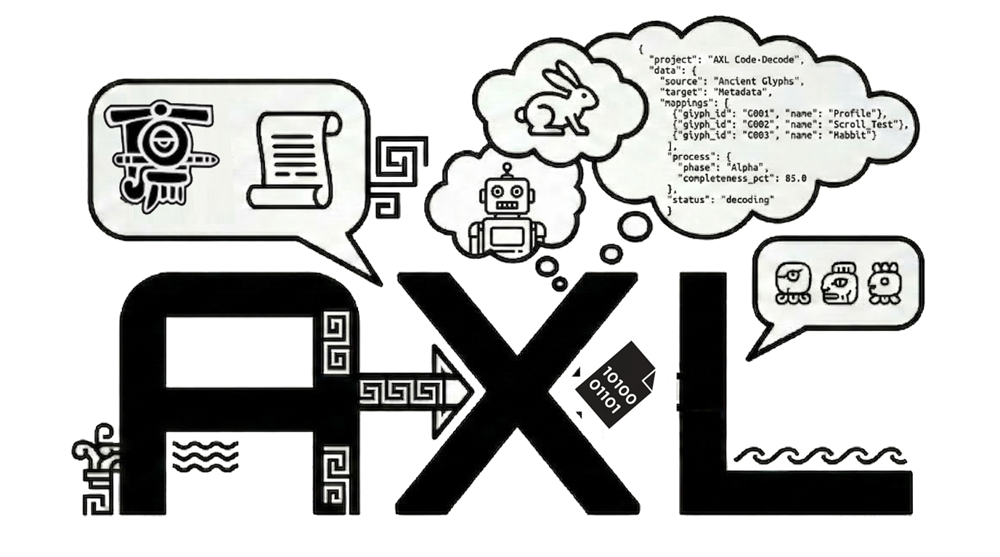

<p align="center">
  
</p>

<p align="center">

[](https://github.com/AXLPROTOCOL/axl-core/actions/workflows/ci.yml)
[](https://pypi.org/project/axl-core/)
[](https://pypi.org/project/axl-core/)
[](https://opensource.org/licenses/Apache-2.0)
[](https://pypi.org/project/axl-core/)

</p>

# axl-core

The Python implementation of the [AXL Protocol](https://axlprotocol.org) — parser, emitter, validator, translator, and CLI for the Agent eXchange Language.

## What is AXL?

AXL (Agent eXchange Language) is a universal communication protocol for agents and autonomous machines. A 133-line specification (the [Rosetta](https://axlprotocol.org/rosetta)) teaches any LLM the complete language on first read — achieving 95.8% comprehension across four major architectures. Two live experiments produced 1,502 packets with 100% parse validity across 11 agents from 10 computational paradigms.

## Quick Start

**Install:**

```bash
pip install axl-core
```

**Parse a packet:**

```python
from axl import parse

packet = parse("π:5:0xS:0.001|S:SIG.3|BTC|69200|↓|RSI|.64|SIG")
print(packet.domain)        # "SIG"
print(packet.tier)           # 3
print(packet.agent_id)       # "5"
print(packet.body.fields)   # ["BTC", "69200", "↓", "RSI", ".64"]
print(packet.flags)         # ["SIG"]
```

**Emit a packet:**

```python
from axl import emit
from axl.models import Body, Packet, PaymentProof, Preamble

packet = Packet(
    preamble=Preamble(
        payment=PaymentProof(agent_id="8", signature="0xPM", gas=0.01),
    ),
    body=Body(domain="PAY", tier=1, fields=["AXL-1", "0.02", "USDC", "local", "task_done"]),
    flags=["LOG"],
)
print(emit(packet))
# π:8:0xPM:0.01|S:PAY.1|AXL-1|0.02|USDC|local|task_done|LOG
```

**Validate:**

```python
from axl import parse, validate

result = validate(parse("π:5:0xS:0.001|S:SIG.3|BTC|69200|↓|RSI|.64|SIG"))
print(result.valid)  # True
print(result.errors) # []
```

**Translate:**

```python
from axl import parse
from axl.translator import to_english, to_json

packet = parse("π:5:0xS:0.001|S:SIG.3|BTC|69200|↓|RSI|.64|SIG")
print(to_english(packet))
# Agent 5: BTC at 69200, falling. RSI pattern detected with 64% confidence.

print(to_json(packet))
# {"domain": "SIG", "tier": 3, "fields": {"asset": "BTC", "price": "69200", ...}}
```

## CLI Usage

```bash
# Parse a packet
axl parse "π:5:0xS:0.001|S:SIG.3|BTC|69200|↓|RSI|.64|SIG"

# Validate a packet
axl validate "π:5:0xS:0.001|S:SIG.3|BTC|69200|↓|RSI|.64|SIG"

# Translate to English
axl translate --to english "π:5:0xS:0.001|S:SIG.3|BTC|69200|↓|RSI|.64|SIG"

# Translate to JSON
axl translate --to json "π:5:0xS:0.001|S:SIG.3|BTC|69200|↓|RSI|.64|SIG"

# Emit a new packet
axl emit --domain SIG --tier 3 --fields "BTC,69200,↓,RSI,.64" --flags "SIG"

# Print version
axl version
```

## Supported Domains

| Domain | Purpose | Schema |
|--------|---------|--------|
| `OPS` | Infrastructure / operations | target, status, metric, value, threshold, action |
| `SEC` | Security / threat detection | target, threat, severity, action, confidence |
| `DEV` | Development / code lifecycle | repo, branch, status, action, author, confidence, risk |
| `RES` | Research / analysis | topic, sources, confidence, finding |
| `SIG` | Signal broadcast | asset, price, direction, pattern, confidence |
| `COMM` | Communication / routing | from_agent, to_agent, intent, detail |
| `TRD` | Trading / economic action | asset, price, momentum, vol, pattern, conf, action, size, lev, risk |
| `PAY` | Payment transfer | payee, amount, currency, chain, memo |
| `FUND` | Funding request | requester, to, amount, currency, reason, roi, balance, urgency |
| `REG` | Registration / identity | name, pubkey, type, class, referrer |

All domains use positional encoding — field order is defined by the [Rosetta](https://axlprotocol.org/rosetta), and each field position carries a fixed semantic meaning.

## How It Works

AXL packets follow a pipe-delimited format where position defines meaning:

```
@rosetta_url | π:agent:sig:gas | T:timestamp | S:DOMAIN.TIER | fields... | FLAGS
```

- **`@rosetta`** — Self-bootstrapping pointer. First contact only.
- **`π:proof`** — Payment proof: identity + signature + gas fee.
- **`T:timestamp`** — Temporal ordering.
- **`S:DOMAIN.TIER`** — Domain code + confidence tier (1–5).
- **Fields** — Positional body fields per domain schema.
- **Flags** — `LOG`, `STRM`, `ACK`, `URG`, `SIG`, `QRY`.

For the full specification, see the [Whitepaper](https://axlprotocol.org/whitepaper/) and the [Rosetta](https://axlprotocol.org/rosetta).

## Links

- [axlprotocol.org](https://axlprotocol.org) — Landing page
- [Rosetta](https://axlprotocol.org/rosetta) — The 133-line language spec
- [Whitepaper](https://axlprotocol.org/whitepaper/) — Full technical paper
- [Experiment Results](https://axlprotocol.org/results/v2/) — Battleground v2 data

## License

Apache 2.0 — see [LICENSE](LICENSE).

Copyright 2026 AXLPROTOCOL INC.
